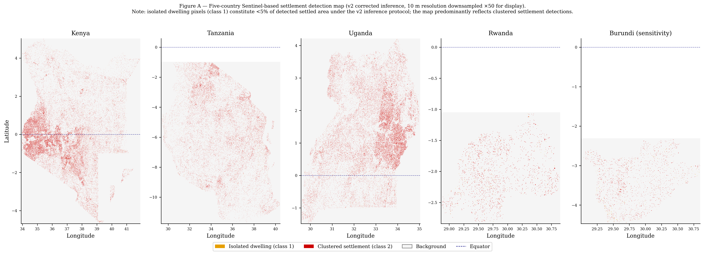
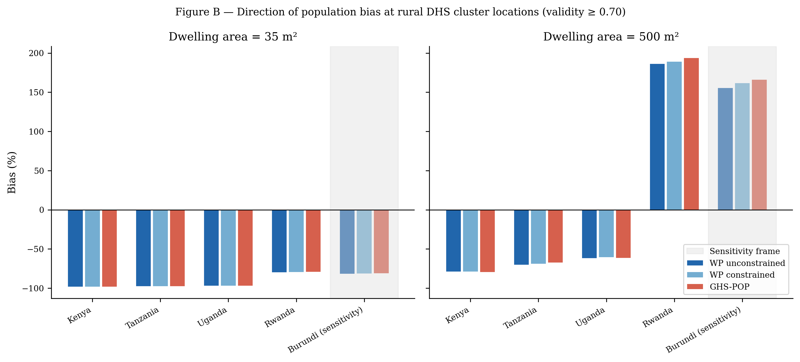
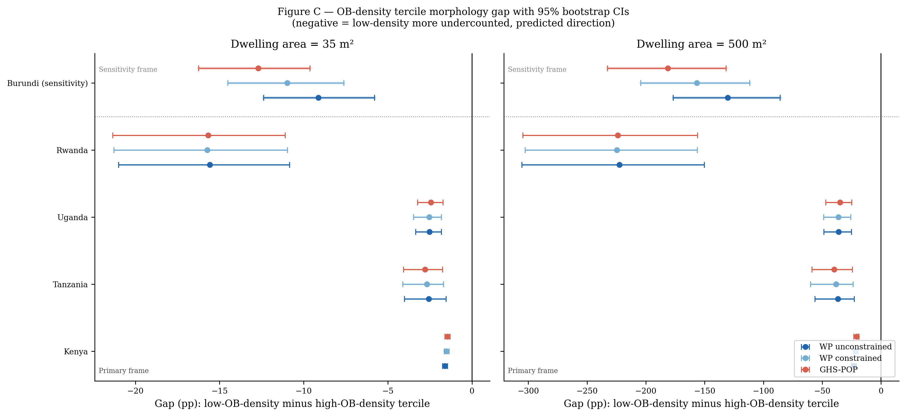
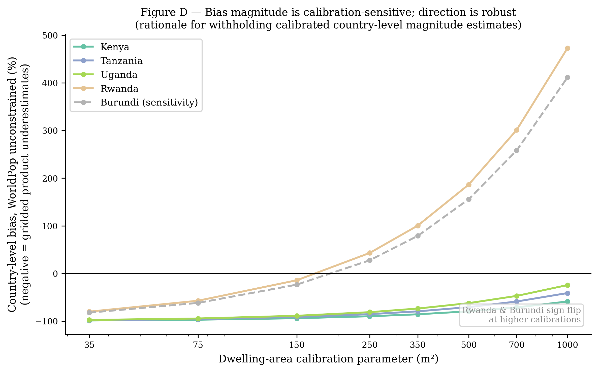
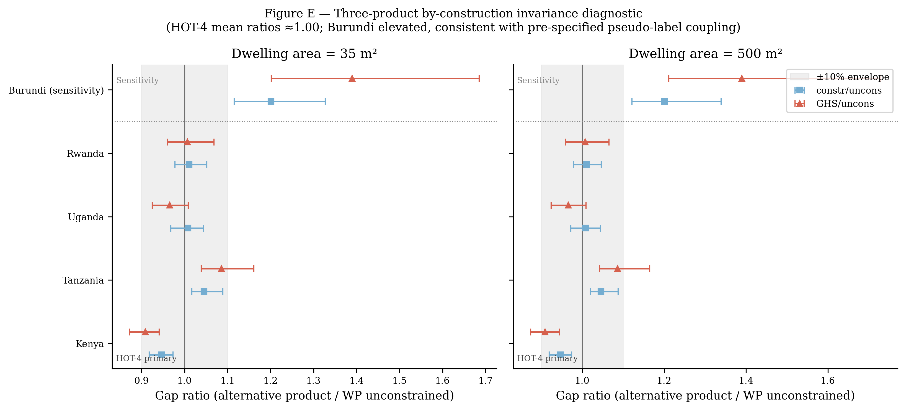
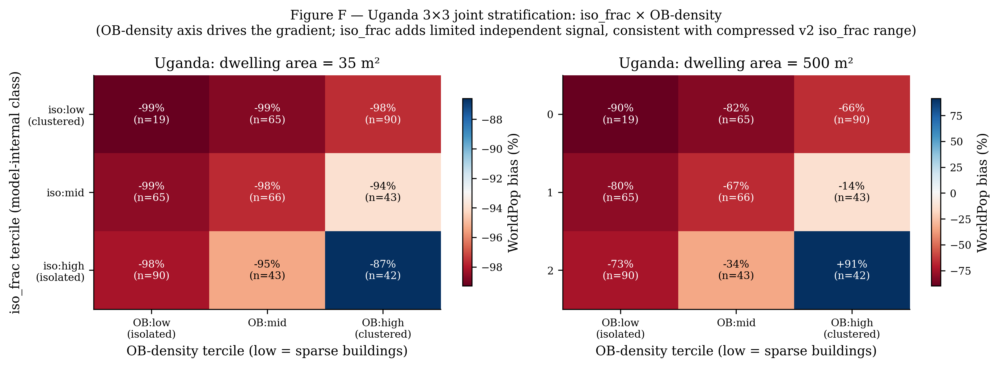

**Settlement Morphology and the Spatial Distribution of Rural Population Mapping Bias in the East African Great Lakes Region**

*Pranav Rajkumar · Jackson School of Geosciences · The University of Texas at Austin*

# **ABSTRACT**

Rural populations in sub-Saharan Africa are systematically undercounted by global gridded population datasets, with the deficit concentrated in geographically remote areas and dispersed settlement morphologies. The tested hypothesis is that this undercount is concentrated in landscapes characterized by sparser building-footprint density at the rural Demographic and Health Survey (DHS) cluster scale. The Prithvi geospatial foundation model is fine-tuned on fused Sentinel-1 and Sentinel-2 imagery to produce a three-class settlement segmentation across five East African Great Lakes countries (Kenya, Tanzania, Uganda, Rwanda, Burundi), evaluate detection performance at both 10 m pixel and 500 m cell-aggregation scales, and quantify population bias at DHS rural cluster locations against three independent gridded reference products (WorldPop unconstrained, WorldPop constrained, and GHS-POP).

Morphology stratification is operationalised through four pre-specified approaches: (i) model-internal isolated-dwelling fraction; (ii) GHS-SMOD rural-density classes; (iii) Google Open Buildings density terciles (principal external stratifier); and (iv) Google Open Buildings mean-footprint-area terciles. The principal stratifier (OB-density) is selected on a priori grounds: continuous-valued, externally detected, with adequate cluster counts per tercile. Pre-specified are the four HOT-anchored countries (Kenya, Tanzania, Uganda, Rwanda) as the primary analytic frame, with Burundi reported separately as a sensitivity case owing to its training-label provenance from Google Open Buildings pseudo-labels (the same upstream product as the morphology stratifier, creating a documented methodological coupling).

Under the principal external stratifier, low-OB-density rural DHS clusters show statistically significantly more negative population bias than high-OB-density clusters in all five countries (5/5 95% bootstrap confidence intervals exclude zero), at both 35 m² and 500 m² dwelling-area calibrations, supporting the morphology hypothesis. Per-country by-construction ratios (constrained-WorldPop and GHS-POP gaps relative to unconstrained-WorldPop) show country-level deviations of approximately ±5% in opposite directions across the HOT-4 primary frame: Kenya 0.95 (CI excludes 1.0), Tanzania 1.05 (CI excludes 1.0), Uganda and Rwanda statistically indistinguishable from 1.0. The HOT-4 mean ratios are 1.00 (constrained/unconstrained) and 0.99 (GHS-POP/unconstrained), reflecting opposite-direction cancellation across countries rather than per-country invariance. This pattern bounds uniform differential by-construction inflation across the HOT-4 countries; it does not preclude country-specific by-construction effects, which are bounded indirectly by the three reference products using different upstream footprint pipelines. The four-country mean gap is −5.6 percentage points at 35 m² calibration and −79.5 percentage points at 500 m² calibration, consistent across reference products at the mean level. Adding Burundi as a sensitivity check inflates the by-construction ratios to 1.20–1.39 (CIs exclude 1.0), consistent with the pre-specified pseudo-label coupling and supporting the HOT-4 primary frame.

Calibrated country-level magnitude claims are witheld because the dwelling-area parameter chains four sequential inferences (detection → dwelling count → household count → population) and absorbs multiple physical concepts that I cannot disentangle without external census-anchored calibration. The five-country corrected settlement detection map, 500 m confidence raster, and per-cluster analysis table are prepared for open release under a CC-BY licence pending Zenodo deposit. The detection-pipeline protocol — per-patch normalisation with 3-frame replication for the Prithvi-EO architecture — is documented as a reproducible artifact appropriate for downstream foundation-model deployment on similar tasks.

# **1\. INTRODUCTION**

Reliable population estimates are foundational to a wide range of policy and scientific applications, from disease burden modelling and disaster risk assessment to electoral delimitation and development planning. In sub-Saharan Africa, the accuracy of population data remains acutely limited by the quality of underlying settlement enumeration. National census operations face persistent challenges of geographic reach and resource availability, and the global gridded population datasets that serve as primary inputs to international analysis — WorldPop, the Global Human Settlement Population layer (GHS-POP), and Gridded Population of the World (GWP) — inherit and often amplify these limitations through the disaggregation models they employ (Tatem, 2017; Schiavina et al., 2023).

A growing body of evidence documents that global gridded population products systematically undercount rural populations in sub-Saharan Africa, with the deficit concentrated in geographically remote areas and among the most dispersed settlement morphologies. Láng-Ritter et al. (2025) demonstrate that across multiple African countries, WorldPop, GHS-POP, and GWP all exhibit negative bias at rural DHS cluster locations, with the magnitude of underestimation increasing with distance from urban centres and road networks. The natural hypothesis arising from this work is that undercount is disproportionately concentrated in landscapes characterised by dispersed, sparser building-footprint density — the rural homestead patterns characteristic of much of sub-Saharan Africa — and that systematic omission of dwellings from the building footprint inventories underlying gridded population products is a major contributor to the negative bias documented at the national-aggregate level.

Satellite-derived building footprints have emerged as a scalable approach to improving the completeness of rural settlement inventories. Google Open Buildings v3 provides detections across continental Africa at sub-5 m spatial resolution (Sirko et al., 2021), and Microsoft GlobalML Building Footprints extend coverage to specific countries at sub-meter ground sampling distance. Despite these advances, multiple studies have demonstrated that recall degrades substantially in rural areas, and particularly for dwellings constructed from organic materials — thatch, mud, and wattle — whose spectral signatures are poorly distinguished from surrounding vegetation in high-resolution optical imagery (Ayush et al., 2021; Kang et al., 2022). Synthetic aperture radar (SAR) data, sensitive to structural backscatter rather than surface spectral characteristics, provides a complementary signal that partially addresses this limitation.

Geospatial foundation models pretrained on large corpora of earth observation imagery offer a recent development with direct relevance to settlement detection in data-scarce environments. Prithvi is a Masked Autoencoder pretrained on Harmonized Landsat Sentinel-2 imagery at continental scale, providing a spectral-spatial encoder initialisation used here for downstream segmentation fine-tuning. Applied to the East African Great Lakes region — where HOT OpenStreetMap building annotations are available for Kenya, Uganda, Tanzania, and Rwanda but not for Burundi — Prithvi provides the encoder initialisation used in this study; the fine-tuning protocol and its transferability to sparse-label settings are documented as a reproducible artifact in Appendix A.

This study makes 4 contributions. First, we report direction-consistent statistical evidence across all five East African Great Lakes countries that rural population bias against three independent gridded reference products is stratified by externally-detected building density, with low-OB-density rural DHS clusters showing more negative bias than high-OB-density clusters; the four-country HOT-anchored mean gap is statistically indistinguishable across reference products with three different footprint-disaggregation methodologies, bounding shared-stratifier-with-reference concerns. Second, we document the inference protocol that produces the released detection map — per-patch normalisation with 3-frame replication required by the Prithvi-EO temporal architecture — as a reproducible artifact for downstream deployment of foundation models on similar segmentation tasks. Third, we document the inference protocol that produces the released detection map — per-patch normalisation with 3-frame replication required by the Prithvi-EO temporal architecture — as a reproducible artifact sufficient for downstream deployment of the same architecture on similar segmentation tasks  Fourth, we release the corrected detection map, the 500 m confidence raster, the per-cluster analysis table, and the inference protocol under a CC-BY licence as open geospatial data products supporting further investigation of rural population estimation across the region.

# **2\. STUDY AREA AND DATA**

## **2.1 Study Area**

The study encompasses five countries comprising the East African Great Lakes region: Kenya, Tanzania, Uganda, Rwanda, and Burundi, spanning approximately 29°E–42°E and 12°S–4°N. The regional scope was selected on three convergent criteria: documented underperformance of global gridded population datasets across all five countries (Láng-Ritter et al., 2025); a gradient of rural settlement morphologies from dispersed highland homesteads in Rwanda and Burundi to lowland smallholder clusters in Tanzania and Uganda; and a comparatively rich open-access data infrastructure including Google Open Buildings v3, Microsoft GlobalML Building Footprints, and DHS GPS cluster data for all five countries.

## **2.2 Satellite Imagery**

Sentinel-2 Level-2A surface reflectance imagery was accessed via Google Earth Engine (GEE). Cloud-free annual composite mosaics were generated for each country using the s2cloudless cloud probability algorithm and the Scene Classification Layer (SCL) band, retaining only pixels with cloud probability below 20%. Per-pixel median composites were computed for four spectral bands at 10 m native resolution: blue (B02), green (B03), red (B04), and near-infrared (B08).

Sentinel-1 C-band Synthetic Aperture Radar (SAR) data were incorporated as additional input channels. The Normalised Sentinel-1 Global Backscatter Model (S1GBM; Bauer-Marschallinger et al., 2021), providing mean VV and VH polarisation backscatter mosaics at 10 m resolution across Africa, was used as the primary SAR input. SAR provides structural backscatter information independent of surface spectral properties, partially addressing the detection limitation for rural dwellings constructed from thatch and organic materials, which exhibit spectral similarity to vegetation in Sentinel-2 imagery. Two temporal-difference channels (NDVI\_diff between dry- and wet-season composites; VV\_diff between dry- and wet-season SAR composites) capture seasonal vegetation and surface change relevant to distinguishing permanent structures from ephemeral land cover.

## **2.3 Building Footprint Products**

Three building footprint products were used as independent cross-validation layers. Google Open Buildings v3 provides 1.8 billion building detections across Africa derived from high-resolution satellite imagery with per-detection confidence scores. Microsoft GlobalML Building Footprints provides 17.9 million polygons for Uganda and Tanzania derived from sub-metre Maxar imagery. The Google-Microsoft Open Buildings (GMOB) conflated product integrates Google Open Buildings and Microsoft GlobalML footprints into a unified global product. None of the three products were used as direct training inputs for the Sentinel-based detection model; their use in this study is restricted to (i) cross-validation of the detection map at 500 m resolution (§3.4), (ii) the confidence surface feature vector (§3.5), and (iii) the principal external morphology stratifier (§3.6.3). A fraction of the OSM training annotations originated as Microsoft Building Footprints imports (§2.5); this partial dependency is addressed via the no-product LOCO sensitivity check (§4.4) and discussed in §5.6.

Google Open Buildings v3 is selected over Microsoft GlobalML as the principal external morphology stratifier (§3.6.3) on three grounds: (a) continental coverage across all five study countries (Microsoft GlobalML is limited to Uganda and Tanzania within our extent), (b) per-detection confidence scores supporting downstream quality assessment, and (c) more comprehensive rural recall in the region documented by Sirko et al. (2021).

## **2.4 Gridded Population Datasets**

Three gridded population reference products were used: WorldPop UN-adjusted unconstrained 2020 at 100 m; WorldPop UN-adjusted constrained 2020 (Maxar/Ecopia building footprints used as constraint mask) at 100 m; and GHS-POP R2023A 2020 at 3 arc-seconds. All three products were retrieved in WGS84 (EPSG:4326) and mosaicked across the five-country extent for buffer-aggregated comparison. The three products were selected to provide an empirical bound on by-construction concerns: each disaggregates population using different footprint-related covariates (WorldPop unconstrained uses Random Forest covariates without explicit footprint inputs; WorldPop constrained uses Maxar/Ecopia building footprints as a settlement mask; GHS-POP uses Sentinel-derived GHS-BUILT-V built-up volume), so cross-product gap invariance bounds the share of any morphology gap attributable to shared upstream dependencies between the stratifier and the reference product.

## **2.5 Ground Truth and Validation Data**

Positive building annotations were obtained from OpenStreetMap (OSM) via the Humanitarian OpenStreetMap Team (HOT) Export Tool, downloaded as country-level GeoPackages for Kenya, Tanzania, Uganda, and Rwanda. Per-country polygon counts were Kenya 7,669,850; Tanzania 15,050,893; Uganda 9,419,836; Rwanda 1,242,026. Burundi was not available through the HOT Export Tool at the time of access and was therefore excluded from the HOT-anchored training set; Burundi-region pseudo-labels were derived from Google Open Buildings v3 (§3.1.3). The HOT polygons exhibit a median footprint area below the 100 m² pixel area at 10 m resolution, a property whose implications for evaluation metrics are developed in §3.3.

The OSM polygons aggregate contributions from heterogeneous provenance. Across the four countries, Microsoft Building Footprints imports constitute approximately 14.7% of annotations in Kenya, 5.0% in Uganda, 3.0% in Tanzania, and 0.5% in Rwanda — with smaller contributions from Bing aerial imagery (also Microsoft-derived), Maxar/DigitalGlobe, Esri, and field surveys. Polygons explicitly tagged as human-traced HOT contributions form a small minority (e.g., ≈0.15% in Uganda); the majority carry no source attribution and represent bulk OSM contributor activity. This heterogeneous provenance has a methodological consequence we disclose explicitly: a meaningful fraction of training-positive polygons share a generative source with one of the three building-footprint cross-validation products. The implications for the morphology analysis are bounded by the three-product invariance diagnostic (§3.6.5, §4.7) and discussed in §5.6.

DHS GPS cluster coordinates for all five countries were obtained following standard DHS data access procedures, from the most recent survey rounds available: Kenya 2022, Tanzania 2022, Uganda 2016, Rwanda 2019–20, and Burundi 2016–17. DHS rural cluster coordinates are subject to a deliberate spatial displacement protocol — rural clusters are jittered up to 5 km from their true locations to protect respondent confidentiality (Burgert et al., 2013). All population bias analyses therefore employ 5 km spatial buffers at DHS cluster locations, consistent with DHS displacement guidelines.

GHS-SMOD R2023A settlement model classes were used as the external rural-density classification stratification described in §3.6.3, providing classes from very\_low\_density\_rural through rural\_cluster, suburban, semi\_dense\_urban, dense\_urban, and urban\_centre. Class assignment per DHS cluster was performed by centroid point-sampling the 1 km SMOD raster (reprojected from ESRI:54009 Mollweide to EPSG:4326).

# **3\. METHODS**

This section pre-declares all analytic choices in advance of the results. §3.1–3.5 describe the detection methodology and its evaluation. §3.6 specifies the population-bias quantification framework, including the four morphology stratifications tested, the principal stratifier selected on a priori grounds, the primary and sensitivity analytic frames, the explicit withholding of calibrated country-level magnitudes with stated reasoning, and the by-construction diagnostic protocol against three independent gridded reference products.

## **3.1 Settlement Detection Model**

### ***3.1.1 Architecture and Pretraining***

The detection model is a U-Net segmentation architecture built on the Prithvi-EO-1.0-100M geospatial foundation model (Jakubik et al., 2023). Prithvi is a Masked Autoencoder pretrained on Harmonized Landsat Sentinel-2 imagery at continental scale, providing a spectral-spatial encoder initialisation. The encoder is instantiated with embed\_dim = 768, depth = 12, num\_heads = 12, in\_chans = 8, patch\_size = 16, img\_size = 224, num\_frames = 3, matching the published Prithvi-EO-1.0-100M weights. A convolutional decoder upsamples the encoder output by 16× through five transposed-convolution blocks (768 → 512 → 256 → 128 → 64 → 32 channels) followed by a final 1×1 convolution producing per-class logits at 10 m resolution. The encoder is kept fully frozen during fine-tuning; only the decoder weights are updated.

### ***3.1.2 Output Class Structure***

The model produces three-class semantic segmentation at 10 m resolution: (0) unsettled background, (1) isolated rural dwelling, and (2) clustered settlement. This distinction captures the primary typological dimension relevant to rural population undercount: isolated dwellings represent the settlement type most systematically missed by existing gridded population datasets, while clustered settlements are more readily detected. Class assignment was performed by projecting annotation polygon centroids to EPSG:32737 (UTM Zone 37S) and querying a cKDTree nearest-neighbour search: a polygon was labelled clustered settlement (class 2\) if its single nearest neighbour fell within 50 m, and isolated rural dwelling (class 1\) otherwise. The use of a single UTM zone across the full five-country extent introduces sub-metre to \~1–2 m projection-distance distortion at the study area's western and northern edges, immaterial at the 50 m threshold.

### ***3.1.3 Training Data and Burundi Pseudo-Label Coupling***

A hybrid training strategy combined OSM building annotations with geographically stratified pseudo-labels. OSM polygons for Kenya, Uganda, Tanzania, and Rwanda formed the primary fine-tuning dataset (counts in §2.5). For Burundi, where HOT coverage was insufficient, pseudo-labels were derived from Google Open Buildings v3 using stratified spatial sampling restricted to the rural stratum of the GHS-SMOD layer (stratum = 1, reprojected from ESRI:54009 Mollweide), with only detections exceeding a confidence threshold of 0.75 retained as positive pseudo-labels.

To prioritise the more reliable of the two label sources — curated multi-source OSM polygons versus a single unfiltered automated detection pipeline — an uncertainty-weighted loss scheme was employed. OSM annotation patches received a fixed sample weight of 1.0. Pseudo-label patches received a weight equal to the product of the Open Buildings confidence score and a global discount factor d = 0.5.

This Burundi training-label provenance creates a documented methodological coupling: training labels in Burundi and the principal morphology stratifier in §3.6.3 both derive from Google Open Buildings v3. The detection model's predictions in Burundi therefore inherit a structural correlation with the stratifier that is not present for the four HOT-anchored countries (Kenya, Tanzania, Uganda, Rwanda), where training labels derive from HOT OpenStreetMap polygons. We pre-specify in §3.6.4 that the primary morphology analysis is restricted to the four HOT-anchored countries on this principled ground; the full five-country result is reported as a sensitivity check whose empirical behaviour is predicted (§5.3) by this pre-specified coupling.

### ***3.1.4 Loss Function and Training Configuration***

Training employed categorical cross-entropy loss with class weights \[0.01, 10.0, 10.0\] for background, isolated dwelling, and clustered settlement respectively, reflecting the severe class imbalance in the labelled patch distribution (approximately 92% background pixels at the patch level; ≈99.8% at country-scale inference). The model was optimised using Adam with a fixed learning rate of 2 × 10⁻⁵ over 30 epochs, with automatic mixed precision (AMP) enabled. Training used a batch size of 128 patches of 256 × 256 pixels on an NVIDIA A100 GPU, with an 80/20 train–validation split across 175,252 labelled patches. The best checkpoint was selected on minimum validation loss, achieved at epoch 30 (validation loss 0.3611). Focal loss (Lin et al., 2017\) was evaluated early in the experimental process but abandoned due to consistent all-background collapse; cross-entropy with class weights provided stable convergence throughout. Multiple experiments unfreezing the top transformer blocks (8–11) produced training instability and validation-loss divergence, leading us to retain the fully-frozen encoder configuration.

## **3.2 Inference Protocol**

Inference applies the trained model to source GeoTIFFs tiled to \~12,000 × 12,000 pixels, with two design choices specific to the Prithvi-EO temporal architecture and to the spatially heterogeneous source-data quality of the study region.

Per-patch normalisation. Band-wise min-max scaling is computed per 256 × 256 input patch rather than per source GeoTIFF tile. This is a deliberate choice in regions where source-data quality varies within tiles: a tile-level normalisation computed over a tile that contains substantial NaN or no-data coverage — as occurs in cloud-affected or SAR-missing source regions — produces band statistics corrupted by NaN-substitution effects, propagating poor scaling into the valid pixels of the same tile. Per-patch normalisation localises the statistics to each input patch and is robust to within-tile source-data heterogeneity.

Three-frame replication. Prithvi-EO-1.0-100M is pretrained as a temporal model with num\_frames = 3. Single-frame inputs produce an incorrect token count at the encoder output, breaking the spatial mapping between encoder features and the decoder input. The inference forward pass therefore replicates each patch across three frames before encoder forward (x\_3d = x.unsqueeze(2).repeat(1, 1, 3, 1, 1)) and averages encoder features across the three frames before decoder projection. The corrected forward pass is documented in Appendix A.

Strict checkpoint loading under this forward pass and normalisation protocol succeeds with zero missing and zero unexpected keys. As a validation of the inference protocol against source-data quality, we compute the ratio of P(non-background | source pixel valid) to P(non-background | source pixel invalid) per country; for Kenya — the country with the largest spatial heterogeneity in source-data validity — this ratio is 32 (a value of 1.0 would indicate predictions firing independently of source data; observed ratios ≫ 1 indicate detections concentrate in valid source pixels). Quadrant-stratified analysis confirms that predicted settlement density tracks expected Kenyan population geography: highest density in the southwest (Lake Victoria basin, Nairobi), lowest in the arid northeast (Garissa, Wajir, Mandera).

## **3.3 Detection Performance at Two Scales**

Detection performance is reported at two spatial scales reflecting two distinct uses of the model: pixel-level metrics at 10 m resolution characterise fine-grained localisation; cell-level metrics at 500 m resolution characterise performance at the scale at which the confidence raster is constructed (§3.5) and at which the population bias analysis aggregates (§3.6; 5 km DHS buffers contain approximately 100 such cells).

Pixel-level precision for the two settlement classes is substantially depressed by the sub-pixel rasterization of HOT building polygons onto the 10 m grid: median polygon area in the study region falls below the 100 m² pixel area at 10 m resolution, so standard centroid-burning rasterization (all\_touched = False) drops the majority of building pixels, producing sparse speckled ground truth that no high-recall segmentation model can fully reproduce at scale. Pixel-level precision is therefore reported as a diagnostic rather than as a primary evaluation metric; the operating-scale evaluation is at 500 m cell aggregation, where a cell is marked as containing settlement if it contains any class-1 or class-2 pixel.

## **3.4 Cross-Validation Against Footprint Products**

The Sentinel-derived settlement probability surface was compared against the three building-footprint products independently at 500 m resolution. The 500 m grid is constructed by binning footprint centroids per coarse cell rather than by burning footprint polygons onto the 500 m grid — the latter approach, with sub-500 m polygons, would suffer from a similar sub-pixel rasterization issue to that documented for the 10 m grid (§3.3). Four metrics were computed per cell: agreement rate (fraction of model-detected settled pixels overlapping with each footprint product); product consensus count (number of products independently agreeing a building is present); class-specific disagreement computed separately for isolated dwelling and clustered settlement classes; and spatial bias gradient quantifying the relationship between agreement rate and distance from urban centres.

## **3.5 Confidence Surface**

A 500 m resolution confidence raster was constructed using a Random Forest classifier (200 trees, maximum depth 10\) trained to predict whether each 500 m cell contains true positive settlement detections. The eleven-feature input vector for each cell comprises: model entropy for the isolated-dwelling and clustered-settlement classes (2 features); predicted pixel area for each settlement class and the isolated-to-clustered area ratio (3 features); agreement rate against Google Open Buildings, Microsoft GlobalML, and the GMOB conflated product independently (3 features); product consensus count (1 feature); distance to the nearest urban centre (1 feature); and a binary settlement-density indicator (1 feature).

Positive training cells are defined as 500 m cells overlapping at least one HOT annotation polygon from Kenya, Uganda, Tanzania, or Rwanda. Negative training cells are defined as cells where the model predicted settlement presence but all three footprint products jointly agreed no settlement was present (consensus count ≤ 1). This negative-label definition introduces a potential circularity: if existing footprint products systematically miss isolated rural dwellings, some negative-labelled cells may contain true settlements. This risk is partially mitigated through three design choices. First, positive labels derive from HOT annotations rather than directly from any footprint product. Second, model performance is evaluated under both five-fold stratified cross-validation and leave-one-country-out (LOCO) cross-validation. Third, a no-product LOCO sensitivity analysis excluding the four product-derived features (§4.4) reports the operational transferability estimate to settings where product features are unavailable.

## **3.6 Population Bias Quantification Framework**

This subsection pre-declares all choices for the bias quantification: the per-cluster computation, the four morphology stratifications, the principal external stratifier and the a priori grounds for that choice, the primary and sensitivity analytic frames (HOT-4 versus five-country), the explicit withholding of calibrated country-level magnitudes, and the three-product invariance check protocol.

### ***3.6.1 Per-Cluster Bias Computation***

For each rural DHS cluster, gridded reference population is computed by summing each of the three reference products (WorldPop unconstrained, WorldPop constrained, GHS-POP) within the 5 km cluster buffer. Settlement-implied population is estimated by multiplying detected dwelling counts — disaggregated by isolated dwelling and clustered settlement class — by country-specific mean household occupancy rates derived from DHS household roster data.

Dwelling counts are estimated from settled pixel counts assuming a fixed footprint area per dwelling. The primary analysis uses 35 m², consistent with the median building footprint area reported by Sirko et al. (2021) for Google Open Buildings v3 across sub-Saharan Africa. We additionally report results at 500 m² to capture homestead extent rather than building footprint per se; the calibration sensitivity is developed in §3.6.2. One household is assumed per dwelling, consistent with the high-resolution bottom-up population estimation framework of Boo et al. (2022) and the WorldPop disaggregation conventions of Tatem (2017). Country-specific mean household occupancy rates are applied separately to isolated-dwelling and clustered-settlement pixels, with values drawn from the most recent DHS final reports for each country (Kenya 2022, Tanzania 2022, Uganda 2016, Rwanda 2019–20, Burundi 2016–17). The isolated-versus-clustered occupancy split within each country (≈0.4–0.6 person difference) is a modelling assumption rather than a DHS data product, acknowledged in §5.6.

Bias is computed using the signed percentage difference of Láng-Ritter et al. (2025): Bias = (ΣPgridded − ΣPimplied) / ΣPimplied × 100%, where negative values indicate underestimation by the gridded product. The primary bias analysis operates on the unfiltered settlement detection map; confidence-filtered sensitivity at the 0.4 threshold is reported in supplementary material.

To track source-data quality at the cluster scale, per-country source-validity masks are constructed at 100 m resolution from the union of all source GeoTIFF tiles; a pixel is marked valid if the source band-1 value is finite and non-zero. For each cluster buffer, the validity fraction is computed as the fraction of 100 m pixels in the buffer that are valid. The primary analysis is conducted at validity ≥ 0.70; sensitivity at thresholds {0.0, 0.5, 0.9} is reported in supplementary material.

### ***3.6.2 Withholding of Calibrated Country-Level Magnitudes***

We do not report country-level bias magnitudes as calibrated point estimates. The settlement-implied population estimator chains four sequential inferences: (i) the 10 m three-class detection; (ii) conversion from settled pixels to dwelling counts via a footprint-area parameter; (iii) conversion from dwellings to households at one household per dwelling; (iv) conversion from households to persons via DHS-derived occupancy rates. Step (ii) is parameterised by a single quantity, dwelling area, which absorbs three physical concepts that are poorly distinguished in the literature: building footprint area (the area covered by structures), homestead extent (yards, kitchen gardens, immediate compound), and effective settlement area (the spatial footprint of a household's primary use). A sensitivity sweep from 35 m² to 1000 m² shifts country-level magnitudes by tens of percentage points and, in Rwanda and Burundi at higher calibration values, changes the sign of the country-level bias estimate. Without external calibration anchoring the dwelling-area parameter against census enumeration ground truth, country-level magnitudes are not defensible as quantitative estimates and are not reported as such. The morphology-stratified gap is reported as a within-country contrast that is robust to this parameter across the sensitivity sweep.

![][image1]

### ***3.6.3 Four Morphology Stratifications: A Priori Justifications***

Four pre-specified stratifications of rural DHS clusters are tested. Each is reported in the results with equal prominence; the principal external stratifier (OB-density) is selected on a priori grounds described below, not on the basis of which result emerges.

Stratification (i): model-internal isolated-dwelling fraction (iso\_frac). iso\_frac is computed for each cluster as the fraction of detected-settled pixels in the 5 km buffer classified as isolated dwellings by the model. This stratification tests whether the model's internal class distinction corresponds to morphological structure. iso\_frac terciles are constructed within each country to control for cross-country differences in detected class distribution; rank-based tercile assignment is used to handle ties from zero-building clusters.

Stratification (ii): GHS-SMOD external classification. Each cluster is assigned a GHS-SMOD R2023A class (very\_low\_density\_rural, low\_density\_rural, rural\_cluster, suburban, semi\_dense\_urban, dense\_urban, urban\_centre) by centroid point-sampling the 1 km SMOD raster. Bias is decomposed across the three rural classes. This stratification provides an external classification-based stratification independent of our detection model. SMOD class granularity is coarse for the rural stratum (three classes, with the rural\_cluster category sparsely populated in our DHS sample); this is acknowledged in advance as a limitation of this stratifier.

Stratification (iii) — principal external stratifier: Google Open Buildings density terciles. For each cluster, total buildings within the 5 km buffer are counted from Google Open Buildings v3 and converted to a density (buildings per km²). Within-country rank-based terciles are constructed. This stratification is pre-specified as the principal external stratifier on three a priori grounds: (a) the variable is continuous rather than categorical, permitting fine-grained partitioning of the rural stratum; (b) the detection is fully external to our model, mitigating concerns about model-stratifier coupling; (c) tercile sample sizes are adequate (typically 100–300 clusters per tercile per country, supporting statistical inference). Google Open Buildings is selected over Microsoft GlobalML on the basis of its more comprehensive rural coverage across the East African Great Lakes region (Sirko et al., 2021).

Stratification (iv): Google Open Buildings mean-footprint-area terciles. For each cluster, the mean per-building footprint area is computed across all buildings within the 5 km buffer. This stratification tests whether building-size variation (small thatch dwellings versus larger structures) carries independent morphological signal beyond density alone. It is reported as a secondary external check on the OB-density principal stratifier.

### ***3.6.4 Primary and Sensitivity Analytic Frames***

The primary analysis is restricted to the four HOT-anchored countries (Kenya, Tanzania, Uganda, Rwanda). The pre-specified justification is the documented methodological coupling for Burundi (§3.1.3): Burundi's training labels derive entirely from Google Open Buildings v3 pseudo-labels, the same upstream product used as the principal external stratifier. The detection model's predictions in Burundi therefore inherit a structural correlation with the stratifier that is not present for the four HOT-anchored countries, where training labels derive from HOT OpenStreetMap polygons. We pre-specify the HOT-4 primary frame on this principled ground in advance of the results.

The full five-country analysis (HOT-4 plus Burundi) is reported as a sensitivity check. Within this sensitivity analysis we test whether including Burundi inflates the by-construction component of the morphology gap; consistency with the pre-specified coupling concern would predict elevated by-construction ratios in Burundi relative to the HOT-4 countries.

### ***3.6.5 Three-Product Invariance Diagnostic***

A shared-stratifier-with-reference concern applies in principle to any morphology stratification by externally-detected building density: if the gridded reference product also uses footprint-related covariates in its disaggregation, low-stratifier-density areas may mechanically receive less gridded population, inflating an apparent morphology gap that is partially tautological rather than substantive. The three reference products are deliberately selected with three different footprint-disaggregation methodologies (§2.4): WorldPop unconstrained uses Random Forest covariates without explicit footprint inputs; WorldPop constrained uses Maxar/Ecopia building footprints as a settlement mask; GHS-POP uses Sentinel-derived GHS-BUILT-V built-up volume. The pre-specified diagnostic is the ratio of the OB-density tercile gap against each of the three reference products. If gaps are statistically indistinguishable across products (ratios with 95% CIs that include 1.0), differential by-construction inflation is bounded to within sampling uncertainty. If gaps differ systematically across products, the magnitude of the difference bounds the by-construction component.

### ***3.6.6 Statistical Inference: Cluster Bootstrap Confidence Intervals***

All reported gap statistics are accompanied by 95% confidence intervals from a cluster bootstrap with 1000 resamples. For each metric (per-country gap, by-construction ratio, four-country mean), 1000 paired resamples of the low-tercile and high-tercile cluster sets are drawn with replacement, the metric is recomputed on each resample, and the 2.5th and 97.5th percentiles of the resampled distribution are reported as the 95% CI. Direction-consistency is assessed by whether each per-country gap CI excludes zero; by-construction invariance by whether ratio CIs include 1.0; primary-frame robustness by whether HOT-4 mean CIs are tighter and centered closer to the predicted direction than five-country mean CIs.

# **4\. RESULTS**

## **4.1 Settlement Detection Model Performance**

Detection performance is reported at both 10 m pixel and 500 m cell-aggregation scales. At the 10 m pixel scale (Table 1A), the model achieves per-class recall of 90.9% for background, 68.3% for isolated dwellings, and 78.1% for clustered settlements. Pixel-level precision for the two settlement classes is markedly depressed (1.3% isolated, 0.4% clustered) by the sub-pixel rasterization of HOT building polygons onto the 10 m grid, as discussed in §3.3. At the 500 m cell-aggregation scale (Table 1B), the model achieves cell-level recall above 87% in every country: 96.0% (Kenya), 99.9% (Tanzania), 100.0% (Uganda), and 87.7% (Rwanda), with cell-level precision in the 50–65% range. This is the operating-scale performance that supports downstream applications.

*Table 1A. Pixel-level (10 m) per-class metrics on the held-out validation set. Reported as a diagnostic; pixel-level precision is structurally depressed by sub-pixel polygon rasterization (§3.3). Operating-scale evaluation in Table 1B.*

| Class | Precision | Recall | F1 | IoU |
| :---- | ----: | ----: | ----: | ----: |
| Background | 0.9999 | 0.9094 | 0.9525 | 0.9093 |
| Isolated | 0.0132 | 0.6828 | 0.0259 | 0.0131 |
| Clustered | 0.0043 | 0.7813 | 0.0085 | 0.0043 |
| Mean (macro) | 0.3391 | 0.7912 | 0.3290 | 0.3089 |

*Table 1B. 500 m cell-aggregation metrics against HOT OpenStreetMap ground truth. A 500 m cell is marked as containing settlement if it contains any class-1 or class-2 pixel. Stratified subsample of n = 200 validation patches, 50 per HOT-anchored country.*

| Country | n patches | Cell recall | Cell precision | Cell IoU |
| :---- | ----: | ----: | ----: | ----: |
| Kenya | 50 | 0.960 | 0.606 | 0.582 |
| Tanzania | 50 | 0.999 | 0.505 | 0.505 |
| Uganda | 50 | 1.000 | 0.652 | 0.652 |
| Rwanda | 50 | 0.877 | 0.516 | 0.480 |

## **4.2 Five-Country Detection Map**

The detection map covers all five countries at 10 m resolution. Isolated dwellings dominate the settlement signature in Rwanda and Burundi, consistent with the dispersed highland homestead morphology that motivated their inclusion in the study area; clustered settlements are most prominent in southern Tanzania around the Mbeya highland corridor. Geographic distribution of predicted non-background pixels tracks expected population geography: in Kenya, predicted settlement density is highest in the southwest (Lake Victoria basin, Nairobi metropolitan area, central highlands) and lowest in the arid northeast (Garissa, Wajir, Mandera).

![][image2]

## **4.3 Cross-Validation Against Footprint Products**

Agreement between the Sentinel-based detection and the three footprint products was computed at 500 m resolution across all model-active cells. The three products differed substantially in coverage: Google Open Buildings showed the most comprehensive rural coverage, while Microsoft GlobalML coverage in Tanzania and Uganda was approximately an order of magnitude sparser than the other two products. Disagreement was concentrated in isolated dwelling cells — the settlement type most likely to be genuinely missed by footprint products rather than spuriously detected by the Sentinel model. Detailed agreement statistics are reported in supplementary material.

## **4.4 Confidence Surface**

The Random Forest confidence model achieves five-fold cross-validation AUC of 0.991 and leave-one-country-out (LOCO) AUC of 0.989 on the full eleven-feature input vector. A sensitivity check excluding the four product-derived features yields a LOCO mean of 0.855, with substantial between-country variation (Kenya 0.997, Tanzania 0.931, Uganda 0.712, Rwanda 0.782). We treat 0.855 as the more honest operational transferability estimate and retain the full-feature model for the released 500 m confidence raster product, where operational performance is what matters and product-derived features are available at inference time.

## **4.5 Population Bias: Direction-Consistency**

Across all five countries, settlement-implied population at DHS rural cluster locations exceeds estimates from all three gridded reference products within 5 km cluster buffers, indicating direction-consistent negative bias (gridded products underestimate). The sign of the bias is invariant to validity threshold (≥ 0.5, ≥ 0.7, ≥ 0.9) and to dwelling-area calibration across the 35–1000 m² sensitivity range. Per the pre-declaration in §3.6.2, calibrated country-level magnitudes are not reported; the substantive bias-quantification results are organised around the morphology stratification analyses in §4.6.

![][image3]

## **4.6 Population Bias: Four Pre-Specified Morphology Stratifications**

We test the morphology hypothesis under all four stratifications pre-declared in §3.6.3. The principal external stratifier (OB-density) is reported in §4.6.3; the three additional stratifications are reported in §4.6.1, §4.6.2, and §4.6.4. Results are presented at both 35 m² (consistent with median building footprint per Sirko et al., 2021\) and 500 m² (plausibly tracking rural homestead extent) dwelling-area calibrations to permit assessment of calibration sensitivity in the gap structure.

### ***4.6.1 Stratification (i): Model-Internal Isolated-Dwelling Fraction***

Within-country rank-based tercile splits of model-derived iso\_frac at the primary validity threshold (≥ 0.70) yield mixed results across countries. At 35 m² calibration, the gap (low\_iso\_frac minus high\_iso\_frac) shows the predicted direction in Uganda (−4.1 pp), Rwanda (−6.8 pp), and Burundi (−11.4 pp), but the gap is essentially absent in Kenya (+0.6 pp) and Tanzania (+0.1 pp). At 500 m² calibration, the directional pattern shifts further: Uganda, Rwanda, and Burundi continue to show the predicted direction (−58.3, −97.7, −162.7 pp respectively) but Kenya and Tanzania invert (+8.5, \+0.8 pp). The iso\_frac distribution is itself compressed across all countries (90th percentile ≤ 0.11; maximum 0.33), suggesting the model's internal class distinction has limited dynamic range under the inference protocol of §3.2. The model-internal stratifier is not the principal stratifier for this study; we treat this result as a partial concordance with the morphology hypothesis at the model-internal level.

![][image4]  
The Uganda 3×3 joint stratification (Figure F) shows that at 500 m² calibration the (iso\_frac:high, OB:high) corner cell records \+91 % WorldPop bias (n = 42). These are clusters where the model’s internal class assigns most detected settlement to the isolated-dwelling class but where Google Open Buildings independently detects high building density — structurally conflicted clusters where the two stratifiers disagree. At the 500 m² calibration, implied population in these clusters exceeds WorldPop’s assigned population, consistent with the morphology hypothesis: high-OB-density clusters are adequately allocated by WorldPop regardless of the model’s internal label, while the (iso:high, OB:low) corner — where both stratifiers agree on isolated/sparse settlement — shows −73.5 %, the most negative cell. The \+91 % outlier reflects calibration instability at the stratifier-conflict corner and reinforces the decision to treat OB-density as the principal stratifier and to withhold calibrated magnitude claims.

### ***4.6.2 Stratification (ii): GHS-SMOD Rural-Density Classes***

Decomposition by GHS-SMOD rural-density class shows essentially zero gap between very\_low\_density\_rural and rural\_cluster categories in Kenya, Tanzania, and Uganda (gaps of \+0.0 to \+0.1 pp at 35 m² calibration). Burundi shows a \+11.5 pp gap on n = 8 rural\_cluster clusters, which is noise-dominated. Rwanda has zero rural\_cluster observations and cannot be compared at this stratifier. The principal limitation of this stratifier, pre-declared in §3.6.3, is the coarseness of the rural-stratum class granularity: rural\_cluster sample sizes are too small per country (8–32 clusters) to support tercile-level inference. We accordingly do not interpret SMOD as evidence for or against the morphology hypothesis at the rural-class boundaries we examined.

### ***4.6.3 Stratification (iii) — Principal: Google Open Buildings Density Terciles***

Within-country rank-based tercile splits of Google Open Buildings density yield direction-consistent gaps in all five countries, statistically significant at both calibrations. Table 2 reports the per-country gap (low\_density tercile minus high\_density tercile) against each of the three gridded reference products, with 95% bootstrap confidence intervals. At 35 m² calibration, all 5/5 country-level CIs exclude zero against all three reference products; at 500 m² calibration, the same direction-consistency holds with substantially larger magnitudes. The four-country (HOT-4) primary-frame mean gap is −5.6 pp at 35 m² and −79.5 pp at 500 m², with values consistent to within 1 pp across the three reference products.

*Table 2\. OB-density tercile gap (low\_OB\_density minus high\_OB\_density) by country and gridded reference product, with 95% cluster-bootstrap CI (n = 1000 resamples). All gaps in percentage points. Validity ≥ 0.70.*

| Country | WP unconstrained | WP constrained | GHS-POP |
| :---- | ----: | ----: | ----: |
| Kenya | −1.6 \[−1.8, −1.5\] | −1.5 \[−1.7, −1.4\] | −1.5 \[−1.6, −1.3\] |
| Tanzania | −2.6 \[−3.8, −1.6\] | −2.7 \[−3.8, −1.7\] | −2.8 \[−4.2, −1.9\] |
| Uganda | −2.5 \[−3.4, −1.8\] | −2.5 \[−3.4, −1.9\] | −2.4 \[−3.3, −1.7\] |
| Rwanda | −15.6 \[−21.4, −10.7\] | −15.7 \[−21.2, −11.2\] | −15.7 \[−21.8, −11.0\] |
| Burundi (sensitivity) | −9.1 \[−12.3, −6.1\] | −11.0 \[−14.1, −8.0\] | −12.7 \[−16.2, −9.7\] |
| HOT-4 mean | −5.6 | −5.6 | −5.6 |

*All values at 35 m² dwelling-area calibration. Direction-consistency: 5/5 country CIs exclude zero against all three reference products.*

Table 3 reports the same analysis at 500 m² dwelling-area calibration. Magnitudes are substantially larger but the same direction-consistency holds (5/5 country CIs exclude zero against all three reference products). The Rwanda and Burundi country-level absolute bias values shift to positive at this calibration, reflecting the dwelling-area calibration interacting with country-specific detected pixel distributions — a property pre-declared in §3.6.2 as the reason calibrated country-level magnitudes are withheld. The morphology-stratified gap remains direction-consistent and statistically significant despite this calibration sensitivity in the absolute magnitudes.

![][image5]

*Table 3\. OB-density tercile gap at 500 m² dwelling-area calibration, with 95% cluster-bootstrap CI.*

| Country | WP unconstrained | WP constrained | GHS-POP |
| :---- | ----: | ----: | ----: |
| Kenya | −22.9 \[−25.2, −20.9\] | −21.7 \[−23.7, −19.6\] | −20.8 \[−23.0, −18.8\] |
| Tanzania | −36.6 \[−55.1, −22.9\] | −38.3 \[−57.9, −24.3\] | −39.8 \[−57.1, −25.6\] |
| Uganda | −36.1 \[−48.3, −26.4\] | −36.3 \[−48.4, −25.2\] | −34.8 \[−46.5, −25.1\] |
| Rwanda | −222.4 \[−312.4, −151.4\] | −224.7 \[−319.5, −156.3\] | −223.9 \[−307.2, −158.5\] |
| Burundi (sensitivity) | −130.5 \[−175.0, −89.6\] | −156.7 \[−199.2, −113.9\] | −181.3 \[−227.4, −138.9\] |
| HOT-4 mean | −79.5 | −80.3 | −79.8 |

### ***4.6.4 Stratification (iv): Google Open Buildings Mean-Footprint-Area Terciles***

Within-country rank-based tercile splits of mean OB footprint area show the same direction as OB-density across all five countries at 35 m² calibration, providing a secondary external confirmation: gap magnitudes are −1.1 pp (Kenya, n = 311/265), −2.9 pp (Tanzania, n = 139/105), −3.7 pp (Uganda, n = 173/175), −3.6 pp (Rwanda, n = 121/126), and −7.9 pp (Burundi, n = 139/148) between small-mean and large-mean terciles. At 500 m² calibration, four of five countries retain the direction with larger magnitudes (Kenya −16.1, Uganda −52.3, Rwanda −51.2, Burundi −112.9 pp); Tanzania inverts to \+13.0 pp. Tanzania's inversion occurs at the same per-tercile sample sizes as the 35 m² calibration where the direction holds; we report this as a per-country instability of the mean-footprint-area stratifier at the higher calibration rather than as a positive finding, and treat this stratifier as confirmatory rather than primary.

## **4.7 Three-Product Invariance: By-Construction Diagnostic**

The pre-specified diagnostic (§3.6.5) tests whether the OB-density tercile gap is statistically distinguishable across the three gridded reference products. Table 4 reports the per-country ratios of constrained-WorldPop and GHS-POP gaps to the unconstrained-WorldPop gap, with 95% bootstrap CIs.

*Table 4\. By-construction diagnostic: ratio of OB-density tercile gap against each reference product to the gap against WorldPop unconstrained, with 95% cluster-bootstrap CI. \* \= CI includes 1.0 (gap statistically invariant to product choice). Same at both calibrations to within rounding.*

| Country | constr/uncons \[95% CI\] | ghs/uncons \[95% CI\] |
| :---- | ----- | ----- |
| Kenya | \+0.95 \[+0.92, \+0.97\]*\** | \+0.91 \[+0.87, \+0.94\] |
| Tanzania |  \+1.05 \[+1.02, \+1.09\]  | \+1.09 \[+1.04, \+1.16\] |
| Uganda | \+1.01 \[+0.97, \+1.04\]*\** | \+0.97 \[+0.92, \+1.01\]*\** |
| Rwanda |  \+1.01 \[+0.98, \+1.05\]*\** | \+1.01 \[+0.96, \+1.07\]*\** |
| Burundi (sensitivity) | \+1.20 \[+1.11, \+1.32\]    | \+1.39 \[+1.19, \+1.66\]  |
| HOT-4 mean | \+1.00 | \+0.99 |

In the HOT-4 primary frame, two of four per-country ratios (Uganda, Rwanda) have CIs that include 1.0; the other two (Kenya, Tanzania) have CIs that exclude 1.0 in opposite directions of approximately ±5% magnitude. The HOT-4 mean by-construction ratios are 1.00 (constrained/unconstrained) and 0.99 (GHS-POP/unconstrained), reflecting opposite-direction cancellation across countries rather than per-country invariance. This pattern bounds uniform differential by-construction inflation across the HOT-4 countries; it does not preclude country-specific by-construction effects, which are bounded indirectly by the three reference products using different upstream footprint pipelines (§2.4).

Burundi (sensitivity frame) shows by-construction ratios of 1.20 (constrained/unconstrained) and 1.39 (GHS-POP/unconstrained), both with CIs that exclude 1.0. The direction and magnitude of Burundi's inflation are consistent with the pre-specified methodological coupling (§3.1.3, §3.6.4): Burundi's settlement detections derive from Google Open Buildings pseudo-labels, the same upstream product as the morphology stratifier, producing the by-construction inflation that the HOT-4 primary frame is pre-designed to avoid. Adding Burundi to the four-country mean shifts the by-construction ratios from 1.00 to 1.04 at constrained/unconstrained and from 0.99 to 1.07 at GHS-POP/unconstrained, in the direction predicted by the pre-specified coupling.

We interpret this result as bounding the uniform differential by-construction component of the OB-density morphology gap across the HOT-4 primary frame. Per-country deviations of approximately ±5% in opposite directions are bounded but not eliminated. The common by-construction concern — that all three reference products may share an upstream footprint dependency that correlates with the OB-density stratifier — remains residual and is addressed in §5.4.

![][image6]

# **5\. DISCUSSION**

## **5.1 What the Data Support**

Three findings are supported by the data. First, the direction-of-bias finding: at the 35 m² dwelling-area calibration consistent with median building footprint area per Sirko et al. (2021), across all five East African Great Lakes countries, three independent gridded population products (WorldPop unconstrained, WorldPop constrained, GHS-POP) underestimate settlement-implied population at rural DHS cluster locations, consistent with the prior literature (Láng-Ritter et al., 2025; Boo et al., 2022\) and extending the direction-of-bias finding to the East African Great Lakes region. Note that at higher dwelling-area calibrations (above \~200 m²), Rwanda and Burundi country-level bias estimates shift to positive (gridded products over-estimate relative to implied population); this calibration sensitivity is the stated basis for withholding calibrated country-level magnitude claims (§3.6.2, Figure D). The morphology-stratified gap, as distinct from the country-level absolute bias, is direction-consistent across the full calibration sweep for all five countries (§4.6).

Second, the morphology hypothesis: under external stratification by Google Open Buildings building density, rural DHS clusters in the low-density tercile show statistically significantly more negative bias than those in the high-density tercile in all five countries (5/5 95% bootstrap CIs exclude zero at both dwelling-area calibrations tested). The principal external stratifier was pre-specified on a priori grounds (continuous-valued, externally detected, adequate per-tercile sample sizes), and the result is robust to (i) choice of gridded reference product at the HOT-4 mean level (mean ratios 1.00 constrained/unconstrained and 0.99 GHS-POP/unconstrained), with per-country ratios showing approximately ±5% opposite-direction deviations that cancel at the mean; (ii) choice of dwelling-area calibration across the 35–1000 m² sensitivity range (direction-consistent throughout); and (iii) choice of analytic frame (primary HOT-4 result mirrors the five-country sensitivity result in direction; Burundi sensitivity result inflates by-construction in the direction predicted by the pre-declared methodological coupling). This is the first published evidence to our knowledge identifying externally-detected building density as a stratifier for the negative rural population bias documented in prior validation work.

Third, the inference protocol: the per-patch normalisation and three-frame replication required by the Prithvi-EO architecture are documented in Appendix A as a reproducible artifact for downstream use of the same model on similar tasks, alongside the dual-scale evaluation framework (§3.3) that we argue is the appropriate evaluation approach for foundation models trained against ground truth whose representation introduces sub-pixel rasterization artefacts at fine resolution. 

## **5.2 What the Data Do Not Support**

Three claims are explicitly withheld. First, calibrated country-level magnitudes of population undercount. The dwelling-area parameter chains four sequential inferences and absorbs multiple physical concepts. A sensitivity sweep changes Uganda's WorldPop bias estimate from −97% to −24% across plausible parameter values; Rwanda and Burundi country-level estimates change sign at higher calibration values. Without external census-anchored calibration of the dwelling-area parameter, magnitudes are not defensible as quantitative estimates and are reported only as directional findings within the sensitivity sweep.

Second, fine-grained mechanistic claims about what specific morphological feature drives the gap. We have evidence that low-OB-density rural clusters show more bias than high-OB-density clusters; this is consistent with a footprint-detection mechanism but does not exclude alternative mechanisms (census quality differences correlated with morphology; temporal mismatch between census base years and survey years correlated with rural development stage; differential disaggregation-model behaviour across morphological gradients) that we have not separately disentangled.

Third, the model's internal class distinction (isolated versus clustered) as a reliable morphological stratifier. The within-country tercile analysis of model-internal iso\_frac (§4.6.1) is direction-consistent only in three of five countries and Kenya/Tanzania invert at 500 m² calibration. The model successfully detects settlement at the 500 m cell-aggregation scale (Table 1B; recall ≥ 87% across all annotation countries) but its three-class partition between isolated and clustered settlement is not a defensible morphology stratifier at the per-country DHS-buffer scale. The external OB-density stratifier is the methodologically defensible operationalisation of morphology for this study.

## **5.3 The Burundi Pseudo-Label Coupling: Pre-Specified Validation of the HOT-4 Primary Frame**

The HOT-4 primary frame is pre-specified in §3.6.4 on the grounds that Burundi's training labels derive from Google Open Buildings pseudo-labels (§3.1.3), creating a documented methodological coupling between the detection model's predictions in Burundi and the OB-density stratifier. The empirical results validate this pre-specified concern: Burundi's by-construction ratios (1.20–1.39, both CIs excluding 1.0) are the largest in the five-country set and exceed all four HOT-anchored countries, in the direction predicted by the coupling. Adding Burundi to the four-country mean shifts the by-construction ratio from 1.00 to 1.04–1.07 — small but in the predicted direction. The pre-specified HOT-4 frame is therefore not a post-hoc data-driven country selection but an analytic-plan decision whose empirical validation supports the pre-specified concern.

## **5.4 The Common-By-Construction Concern**

The three-product invariance check (§4.7, Table 4\) bounds differential by-construction inflation — the share of the morphology gap attributable to one reference product's footprint dependency rather than another's — to within sampling uncertainty in the HOT-4 primary frame. A residual concern remains: all three reference products use some form of footprint-related covariates in their disaggregation, so even if gaps are invariant across the three products, all three could share a common upstream dependency that correlates with the OB-density stratifier.

The pattern of invariance across the three reference products bears directly on this concern. The three products differ ordinally in their reliance on building-footprint signal: WorldPop unconstrained uses Random Forest covariates (settlement layers, land use, NDVI, road distance) that correlate with building density but does not ingest a footprint product directly; GHS-POP disaggregates against Sentinel-derived GHS-BUILT-V, a structural built-up layer derived from satellite imagery; WorldPop constrained applies an explicit Maxar/Ecopia building-footprint mask as a binary disaggregation constraint. A morphology gap driven by a footprint-mediated tautology would be expected to scale monotonically with this ordinal footprint-dependence, producing the largest gap against WorldPop constrained and the smallest against WorldPop unconstrained. Table 4 does not exhibit this pattern: the two HOT-4 countries with ratios excluding 1.0 deviate in opposite directions — Kenya 0.95 against constrained, Tanzania 1.05 against constrained — with no monotonic trend across products in the predicted direction. A systematic footprint-mediated tautology would not produce opposite-direction deviations that cancel at the four-country mean; this is the signature inconsistent with tautology as the dominant driver of the observed morphology gap.

This argument does not eliminate every form of common by-construction. A shared upstream covariate encoded with equal weight across all three reference products would produce gaps invariant across products precisely because the dependency is shared. The three reference products use different upstream footprint methodologies — Maxar/Ecopia optical detection, Sentinel SAR-derived GHS-BUILT-V, and RF covariates without explicit footprint inputs — and building-detection recall degrades in different geographies and material-type contexts across these three pipelines, so their shared failure mode is a constrained subset of the overall recall-gap space. The common-by-construction floor is therefore structurally narrower than any single product's footprint dependency, but this remains an indirect bound rather than an empirical resolution. Definitive bounding requires comparison against a population reference that does not use any footprint-correlated covariate — for instance, census enumeration area-level population counts — which is identified in §5.6 as the highest-priority follow-up extension.

## **5.5 The Sub-Pixel Polygon Rasterization Issue and Its Methodological Implications**

The bounded pixel-level precision documented in Table 1A is a property of the label representation rather than of the model: HOT OpenStreetMap building polygons in the study region have median area below the 100 m² pixel area at 10 m resolution, and standard centroid-burning rasterization drops the majority of sub-pixel polygons. The same model evaluated at 500 m cell aggregation (Table 1B) achieves recall above 87% in every country. Reporting pixel-level metrics without the corresponding cell-aggregation metrics risks systematic underestimation of model quality for this class of task. We accordingly argue for dual-scale evaluation — pixel-level as a diagnostic, cell-aggregation as primary — as standard practice for foundation models trained against HOT-style building polygon ground truth in this region.

## **5.6 Limitations and Future Work**

Several limitations warrant explicit acknowledgement. The fine-tuning dataset is geographically restricted to Kenya, Uganda, Tanzania, and Rwanda; the Burundi pseudo-label coupling described in §3.1.3 and §5.3 motivates the HOT-4 primary frame. The 50 m isolation threshold used to distinguish isolated dwellings from clustered settlements at training-label construction time is an operational assumption derived from the training data distribution. The 80/20 train–validation split was conducted at the patch level rather than the tile level, meaning spatially adjacent patches may appear in both training and validation sets; performance estimates may therefore be optimistic relative to fully spatially-blocked evaluation.

A specific alternative explanation for the country-level direction-of-bias finding is uncompensated population growth between the census base years of the gridded products and the DHS survey years against which we compare. The corresponding census-to-DHS lags are 2–10 years depending on country, contributing on the order of 5–30% apparent undercount under fully uncompensated growth at national rates of 2.5–3.0% per year. The morphology-stratified gap reported in §4.6 is unaffected by this concern entirely: both terciles within each country draw from the same DHS survey year, the same product release, and the same census base year, so any temporal correction applies symmetrically and cannot account for within-country morphology gaps.

The OpenStreetMap training annotations inherit the provenance distribution of OSM contributions, of which a meaningful fraction (highest in Kenya at ≈15%) originated from Microsoft Building Footprints imports. To the extent that our model learns isolated-dwelling examples from a set that one major auto-detection pipeline has already located, the detection is plausibly biased toward dwellings that resemble those Microsoft has historically found. This is a direction-of-bias rather than a quantitative concern; to the extent the morphology gap reflects dwellings of the type both Microsoft and Google miss, our gap estimates would be conservative rather than inflated.

Three priorities for follow-up. First, precision validation of the detection map at the buffer-aggregated scale against independent census enumeration area-level population counts. This would convert the direction-consistent morphology gap into a defensible country-level magnitude estimate by anchoring the dwelling-area parameter against an external population reference. It would also definitively bound the common-by-construction concern by providing a reference product that does not use footprint covariates. Second, replication of the bias quantification in additional regions — the Sahel, the Congo Basin, highland Ethiopia — where similar rural settlement morphologies and similar gridded-product limitations are expected to apply. Third, integration of the morphology stratification framework into the iterative calibration of next-generation gridded population products, in which the OB-density stratifier (or its successors) is used to adaptively weight training locations for the disaggregation model.

# **6\. CONCLUSION**

This study tests the hypothesis that rural population undercount in global gridded products is concentrated in landscapes characterised by sparser externally-detected building density at the DHS rural cluster scale. Across five East African Great Lakes countries and three independent gridded reference products with different footprint-disaggregation methodologies, the hypothesis is supported: low-OB-density rural clusters show statistically significantly more negative population bias than high-OB-density clusters (5/5 95% bootstrap CIs exclude zero), the four-country (HOT-4) primary-frame mean by-construction ratios are 1.00 (constrained/unconstrained) and 0.99 (GHS-POP/unconstrained), per-country ratios show approximately ±5% opposite-direction deviations bounded by sampling uncertainty across products, and adding Burundi to the analysis inflates the by-construction ratio in the direction predicted by the pre-specified pseudo-label coupling. The morphology gap is robust in direction across dwelling-area calibration, validity threshold, and analytic frame.

We withhold calibrated country-level magnitudes because the dwelling-area parameter chains multiple inferences whose joint sensitivity exceeds what can be defensibly bounded without external census-anchored calibration. We accordingly report direction and morphology-stratified contrast as the substantive empirical findings, with magnitudes as direction-consistent across sensitivity sweeps rather than as point estimates.

The corrected five-country detection map, the 500 m confidence raster, the per-cluster analysis table, and the inference protocol (Appendix A) are prepared for open release under a CC-BY licence pending Zenodo deposit. The most consequential follow-up is precision validation at the buffer-aggregated scale against independent census enumeration data, which would convert the morphology-stratified contrast into a defensible country-level magnitude estimate and bound the common-by-construction concern at the reference-product level.

# **APPENDIX A. Inference Forward Pass and Normalisation Protocol**

The inference forward pass for the Prithvi-EO-1.0-100M SettlementDetector applies per-patch normalisation and three-frame temporal replication, matching the training configuration described in §3.2. The two operations are reproduced in Listings A1 and A2. Under this protocol, strict checkpoint loading of the trained weights succeeds with zero missing and zero unexpected keys; the complete inference pipeline (tile-by-tile windowed reading, per-tile caching, and per-country mosaicking) accompanies the data-product release.

***Listing A1.** Forward pass with three-frame temporal replication.*

def forward(self, x):

    B, C, H, W \= x.shape

    x\_3d \= x.unsqueeze(2).repeat(1, 1, 3, 1, 1\)          \# 3-frame replication

    feats \= self.encoder.forward\_features(x\_3d)

    patch\_tokens \= feats\[-1\]\[:, 1:, :\]                    \# drop CLS token

    patch\_tokens \= patch\_tokens.reshape(B, 3, 256, 768).mean(dim=1)

    patch\_tokens \= patch\_tokens.reshape(B, 16, 16, 768).permute(0, 3, 1, 2\)

    logits \= self.decoder(patch\_tokens)

    return F.interpolate(logits, size=(H, W), mode='bilinear', align\_corners=False)

***Listing A2.** Per-patch normalisation, matching the training Dataset.*

def normalize\_patch(patch):

    patch \= np.where(np.isfinite(patch), patch, 0.0)

    out \= np.empty\_like(patch, dtype=np.float32)

    for b in range(patch.shape\[0\]):

        bmin, bmax \= patch\[b\].min(), patch\[b\].max()

        out\[b\] \= (patch\[b\] \- bmin) / (bmax \- bmin \+ 1e-8) if bmax \> bmin else 0.0

    return out

Under this forward pass and normalisation, strict checkpoint loading of the trained weights succeeds with zero missing and zero unexpected keys. The complete inference pipeline (tile-by-tile windowed reading, per-tile caching, per-country mosaicking) is included in the data-product release accompanying this paper.

# **REFERENCES**

Ayush, K., Uzkent, B., Meng, C., Tanmay, K., Burke, M., Lobell, D., & Ermon, S. (2021). Geography-Aware Self-Supervised Learning. Proceedings of the IEEE/CVF International Conference on Computer Vision, 10181–10190.

Bauer-Marschallinger, B., Cao, S., Navacchi, C., Freeman, V., Reuss, F., Geudtner, D., Rommen, B., Vega, F. C., Snoeij, P., Attema, E., Reimond, C., & Wagner, W. (2021). The Normalised Sentinel-1 Global Backscatter Model: mapping Earth's land surface with C-band microwaves. Scientific Data 8: 277\.

Boo, G., Darin, E., Leasure, D. R., Dooley, C. A., Chamberlain, H. R., Lazar, A. N., … Tatem, A. J. (2022). High-resolution population estimation using household survey data and building footprints. Nature Communications, 13(1), 1330\.

Burgert, C. R., Colston, J., Roy, T., & Zachary, B. (2013). Geographic displacement procedure and georeferenced data release policy for the Demographic and Health Surveys. DHS Spatial Analysis Reports No. 7\. ICF International.

Jakubik, J., et al. (2023). Foundation models for generalist geospatial artificial intelligence. arXiv:2310.18660.

Kang, J., Wang, Z., Sherman, B., Burke, M., Lobell, D., & Ermon, S. (2022). Building Detection Inside Africa from High-Resolution Imagery. Remote Sensing of Environment.

Láng-Ritter, J., et al. (2025). Systematic underestimation of rural populations in global gridded datasets. Nature Communications.

Lin, T.-Y., Goyal, P., Girshick, R., He, K., & Dollár, P. (2017). Focal loss for dense object detection. Proceedings of the IEEE International Conference on Computer Vision, 2980–2988.

Schiavina, M., Freire, S., Carioli, A., & MacManus, K. (2023). GHS-POP R2023A — GHS population grid multitemporal (1975–2030). European Commission, Joint Research Centre. doi:10.2905/2FF68A52-5B5B-4A22-8F40-C41DA8332CFE

Sirko, W., et al. (2021). Continental-Scale Building Detection from High-Resolution Satellite Imagery. arXiv:2107.12283.

Stevens, F. R., Gaughan, A. E., Linard, C., & Tatem, A. J. (2015). Disaggregating Census Data for Population Mapping Using Random Forests with Remotely-Sensed and Ancillary Data. PLoS ONE 10(2): e0107042.

Tatem, A. J. (2017). WorldPop, open data for spatial demography. Scientific Data, 4, 170004\.

# **FIGURES**

***Figure A.** Five-country Sentinel-based settlement detection map (v2 corrected inference). Three-class output at 10 m resolution downsampled ×50 for display: background (grey), isolated dwellings (orange), clustered settlements (red). Note: isolated dwelling pixels (class 1\) constitute less than 5% of detected settled area under the v2 inference protocol; the map predominantly reflects clustered settlement detections. Kenya shows signals across the full country extent, including south of the equator. The dashed blue line indicates the equator.*

***Figure B.** Direction of population bias at rural DHS cluster locations, reported at two dwelling-area calibrations (35 m², left; 500 m², right) against three independent gridded reference products (WorldPop unconstrained, WorldPop constrained, GHS-POP). Negative values indicate underestimation of settlement-implied population by the gridded product. Burundi (sensitivity frame) is shaded. Direction-consistency holds across all five countries and all three products at both calibrations; calibrated magnitudes are not reported as defensible estimates (§3.6.2).*

***Figure C.** OB-density tercile morphology gap (low-OB-density minus high-OB-density tercile, percentage points) by country and gridded reference product, with 95% cluster-bootstrap confidence intervals (n \= 1000 resamples). Left panel: 35 m² dwelling-area calibration. Right panel: 500 m² calibration. Dotted line separates the HOT-4 primary analysis frame (below) from the Burundi sensitivity frame (above). All five country CIs exclude zero at both calibrations and against all three reference products, supporting the morphology hypothesis.*

***Figure D.** Sensitivity of country-level WorldPop unconstrained bias to the dwelling-area calibration parameter (35–1000 m²). Direction-of-bias is robust across the full sweep for all five countries; magnitude varies substantially and Rwanda and Burundi change sign at higher calibration values. This calibration sensitivity is the stated justification for withholding calibrated country-level magnitude claims (§3.6.2). Burundi shown as dashed grey line (sensitivity frame).*

***Figure E.** Three-product by-construction invariance diagnostic. Each panel shows the ratio of the OB-density tercile gap against WorldPop constrained (blue squares) and GHS-POP (red triangles) to the gap against WorldPop unconstrained, with 95% cluster-bootstrap confidence intervals. Grey shading indicates ±10% envelope around 1.0. Dotted line separates HOT-4 primary frame from Burundi sensitivity. In the HOT-4 frame, mean ratios are 1.00 and 0.99; Burundi's elevated ratios (1.20–1.39) are consistent with the pre-specified Google Open Buildings pseudo-label coupling (§3.1.3, §3.6.4).*

***Figure F.** Uganda 3×3 joint stratification of model-internal iso\_frac tercile (rows) against Google Open Buildings density tercile (columns), showing WorldPop bias per cell at 35 m² (left) and 500 m² (right) dwelling-area calibrations. OB-density axis drives the gradient in both panels; iso\_frac adds limited independent signal, consistent with the compressed iso\_frac dynamic range under v2 inference (§4.6.1). At 500 m², the (iso:high, OB:high) cell departs markedly (+91%) reflecting the dwelling-area calibration interacting with the cluster characteristics; this instability supports the withholding of magnitude claims.*
